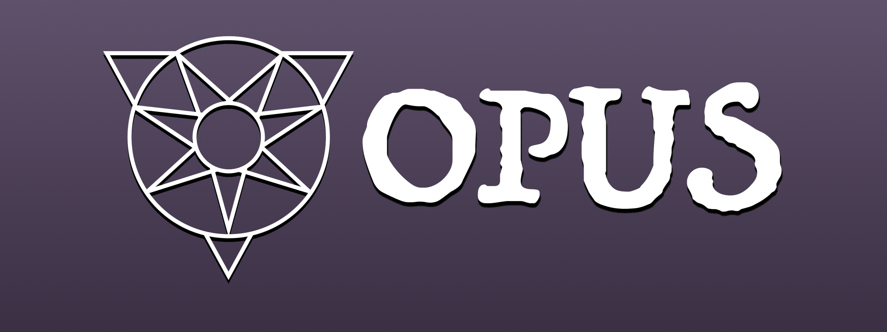
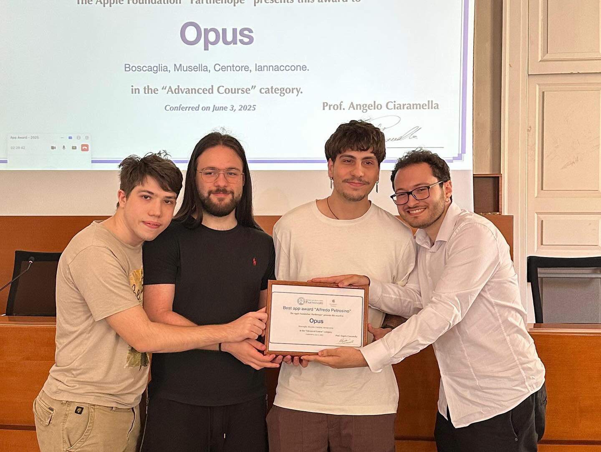
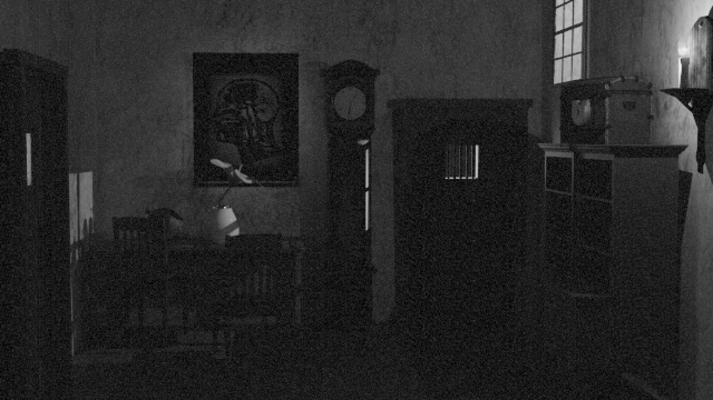
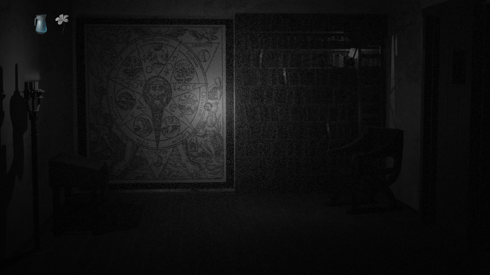
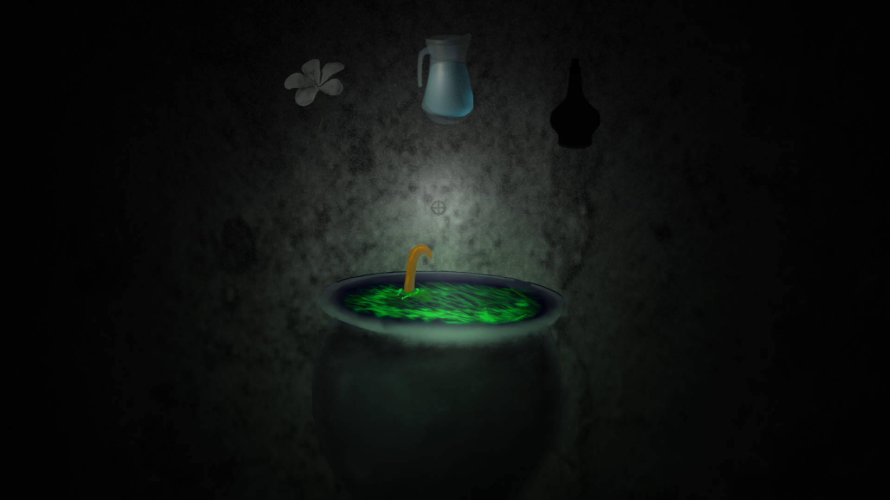
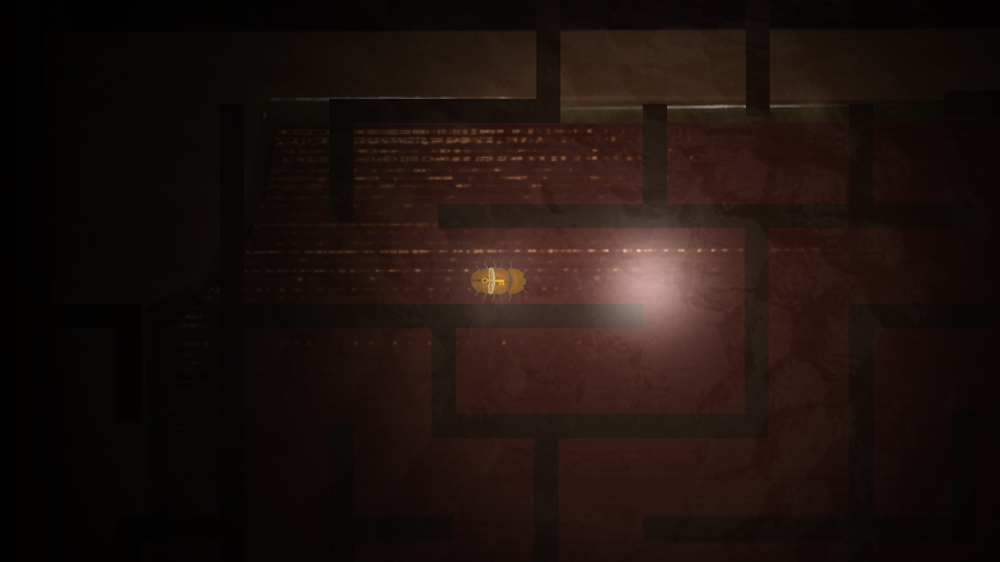
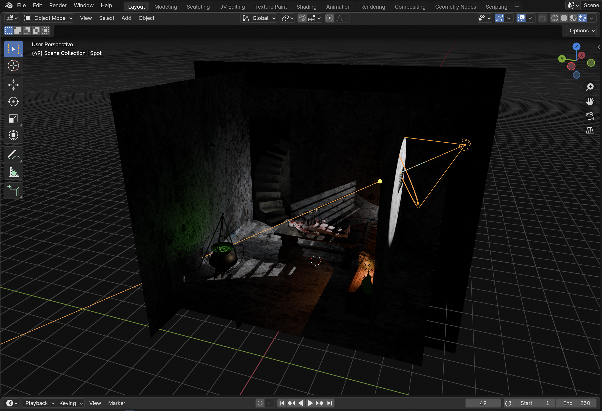
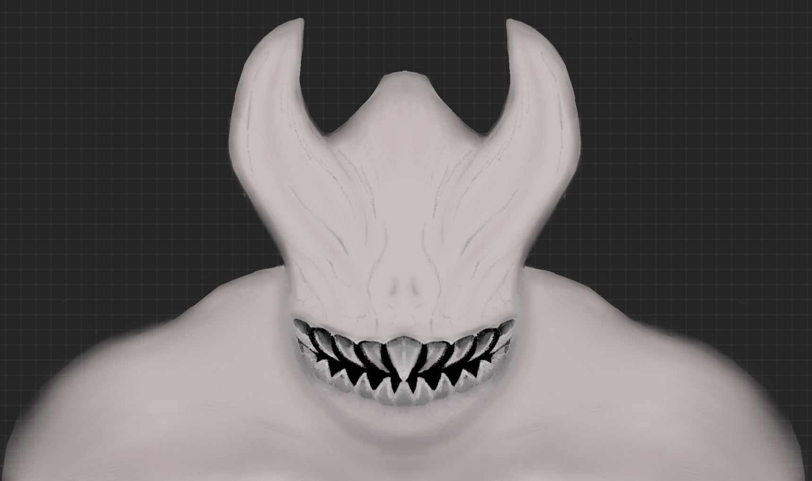

# OPUS



**OPUS** is an immersive point-and-click horror adventure game that transforms your Apple devices into a seamless, multisensory escape room. Designed for iPhone, Apple TV, and Apple Watch, OPUS leverages motion tracking, heart rate monitoring, and local networking to deliver a cross-device gaming experience.

> 🏆 Winner of the *"Alfredo Petrosino - Best App Award"* for innovative use of Apple hardware.

## Concept

You wake up trapped in an old friend's home, now twisted by the aftermath of his alchemical experiments. Your only chance to survive, and save him, is to explore, stay calm, and complete the mysterious *Opus Magna* ritual.

Using your iPhone as a flashlight and input device, your movements sync in real time with the TV, while your Apple Watch tracks your heart rate, amplifying the tension as danger draws near.

* 🔦 Point your phone to explore
* 💓 Control your fear
* 🧩 Solve puzzles and follow clues

## Tech Stack

Built entirely in **Swift**, OPUS takes full advantage of Apple's frameworks:

| Framework               | Purpose                                     |
| ----------------------- | ------------------------------------------- |
| `SpriteKit`             | 2D game engine for rendering and animation  |
| `MultipeerConnectivity` | Real-time local device communication        |
| `CoreMotion`            | Phone orientation and motion tracking      |
| `CoreHaptics`           | Tactile feedback during gameplay            |
| `HealthKit`             | Live heart rate monitoring from Apple Watch |

## Architecture Overview

The project includes multiple targets inside `opus.xcworkspace`:

* `OpusGame` / `OpusTV`: Main game engine running on any iOS device (iPad suggested) or Apple TV
* `OpusIOS`: Companion input controller app with motion handling
* `OpusWatch`: Optional Apple Watch extension for biometric input

**Setup**:

* **Minimum setup:** 1 iOS device + Apple TV or 2 iOS devices
* **Full setup:** iPhone + Apple TV + Apple Watch

## How to Run

1. Clone the repository:

   ```bash
   git clone https://github.com/sunshards/OPUS/
   ```

2. Open `opus.xcworkspace` in Xcode (15+ recommended)

3. Deploy the targets to:

   * **Apple TV or second iOS device** → `OpusTV` / `OpusGame`
   * **Primary iPhone** → `OpusIOS`
   * **Apple Watch (optional)** → `OpusWatch`

## The Team

OPUS was made during the **Apple Foundation Advanced Course** (Naples, 2024) and developed in under a month by a 4-person team.
Special thanks to the course mentors and external UX consultant for design feedback.

| Name                  | Role |
| --------------------- | -------------------------------- |
| **Simone Boscaglia**  | Developer, 3D Modeling, Project Lead |
| **Andrea Iannaccone** | Developer, 3D Modeling |
| **Antonio Musella**   | Audio Design, 3D Modeling |
| **Antonio Centore**   | 2D Art and Visuals |


  <figcaption>Best app award "Alfredo Petrosino".</figcaption>


## Resources

* [Keynote Presentation](https://www.dropbox.com/scl/fi/046akclcnpottd7y50nde/OPUS.key?rlkey=dd5u0bswcdkbuzm5aoaxruk4z&st=rhu0f5zd&dl=0)
* [PowerPoint Version](https://www.dropbox.com/scl/fi/wly6we6syu5espuklz19i/OPUS.pptx?rlkey=83razqi8s62dwnogue4van1rt&st=4sobt6ru&dl=0)
* [PDF Slides](https://www.dropbox.com/scl/fi/nbgbvpfmzpg1nmd5rzkyd/OPUS.pdf?rlkey=zaz4xmv92ffkx3ehertrz8sws&st=p7lhpquh&dl=0)
* [Watch a short demo on YouTube](https://youtu.be/cChrwdk2wd0)


## Screenshots

<table>
<tr>
<td></td>
<td></td>
</tr>

<tr>
<td>Living Room</td>
<td>Library</td>
</tr>

<tr>
<td></td>
<td></td>
</tr>

<tr>
<td>Brew the Opus Magna</td>
<td>Solve puzzles</td>
</tr>

<tr>
<td></td>
<td></td>
</tr>

<tr>
<td>Blender for 3D assets</td>
<td>Custom sprites</td>
</tr>

</table>


## What's Next?

OPUS is a prototype, but the tech stack and core concept are extensible. Potential future work includes:

* Full narrative arc and voice acting
* Integration with Game Center for achievements and stats
* Implement ML models trained on heart rate and motion data to improve player fear detection.

## 📢 Contact

For collaborations or questions, feel free to open an issue or reach out directly.
